# FTL MOD「Arsenal+ English Translation」の日本語パッチ(機械翻訳)

FTL: Faster Than Light の overhaul mod である [Arsenal+ English Translation](https://subsetgames.com/forum/viewtopic.php?t=29891) Version 1.27.1 への日本語パッチ(機械翻訳)です。
英語だとしんどくて機械翻訳で雰囲気だけでも・・と思って作りました。

Arsenal+ English Translation 自体が、ロシア語で作成された Arsenal+ の英語翻訳版なので、ロシア語→英語→日本語(機械翻訳) となります。

## インストールに必要なもの
* FTL: Faster Than Light 本体
* Arsenal+ English Translation のインストールに必要なもの
    * [Slipstream Mod Manager](https://subsetgames.com/forum/viewtopic.php?f=12&t=17102)
      (動作には Java (JRE) が必要。Windows なら [こちら](https://www.java.com/ja/download/ie_manual.jsp) ）
    * [Arsenal+ Base Resources v1.27.1](https://www.dropbox.com/s/ze6hw5x53g5hi6c/ARS%20-%20Base%20Resources%20v1.27.1.ftl?dl=0)
    * [Arsenal+ Base v1.27.1](https://www.dropbox.com/s/po2fjvhu6tvap8x/Arsenal%2B%20English.zip?dl=0)
* 本パッチ

## インストール
当方の環境がWindows/Steamですので、その環境を前提に書いています。違う環境の場合は違うところもあるかもしれませんが、適時置き換えて読んでください。

#### 1. FTLのインストール

#### 2. Slipstream Mod Manager の入手
[Slipstream Mod Manager](https://subsetgames.com/forum/viewtopic.php?f=12&t=17102) をダウンロードしてください。
ページを少し進めると Download と書いてある部分がありますのでダウンロードします。

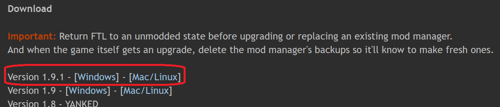

ダウンロード後、zipを解凍してください。インストールは不要です。

解凍すると展開される modman.exe を実行すると起動できます（まだ起動しなくていいです）が、 Java で作成されているので、別途インストールも必要です。インストールされていない場合は、こちらを先にすましておく必要があります。([Windows版Javaのダウンロード](https://www.java.com/ja/download/ie_manual.jsp))

また、mod フォルダが各MODファイルの格納先になっています。modファイルは .ftl の拡張子となっていて、すでに２つのMODが格納されています。
次以降で、ここに Arsenal+ English Translation の .ftl と、その日本語パッチの .ftl を格納します。

#### 3. Arsenal+ English Translation の入手と格納
公式のページに書かれているように以下の２つが必要です。それぞれダウンロードします。
* [Arsenal+ Base Resources v1.27.1](https://www.dropbox.com/s/ze6hw5x53g5hi6c/ARS%20-%20Base%20Resources%20v1.27.1.ftl?dl=0)
* [Arsenal+ Base v1.27.1](https://www.dropbox.com/s/po2fjvhu6tvap8x/Arsenal%2B%20English.zip?dl=0) 

どちらもDropBoxに保存されてます。リンク先の左上に「ダウンロード」と書かれているボタンがあり、クリックするとダウンロードが始まります。

Base Resources は .ftl ファイルがそのままダウンロードできます。
Base はいくつかの .ftl ファイルをまとめた zip ファイルがダウンロードできます。zipのほうは解凍して .ftl ファイルを取り出します。

これらの .ftl ファイルは SlipstreamModManager の mods フォルダに格納します。

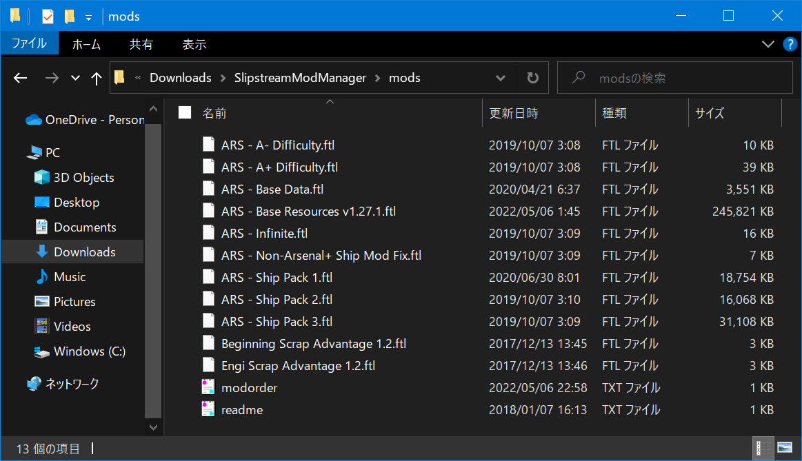

#### 4. 日本語パッチ(機械翻訳) の入手と格納
本ページから 「Arsenal+ English Translation」の日本語パッチ(機械翻訳) をダウンロードします。
こちらも zip ファイルを解凍すると、いくつかの .ftl ファイルができますので同じく mods フォルダに格納します。

#### 5. Slipstream Mod Manager の起動
Slipstream Mod Manager の初回起動時は、FTLのインストール先の指定などの初期設定を要求されます。
環境に合わせて問いに答えます。

* 「FTL のインストール先にある ftl.dat を指定せよ」を指示されます。 Steam であれば ＜Steamのインストール先＞\steamapps\common\FTL Faster Than Light\ にあります。 私の環境の場合、C:\Steam\steamapps\common\FTL Faster Than Light\ にありました。
   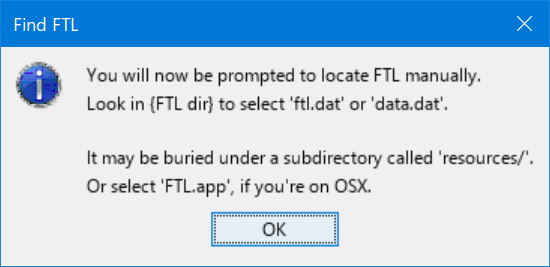
   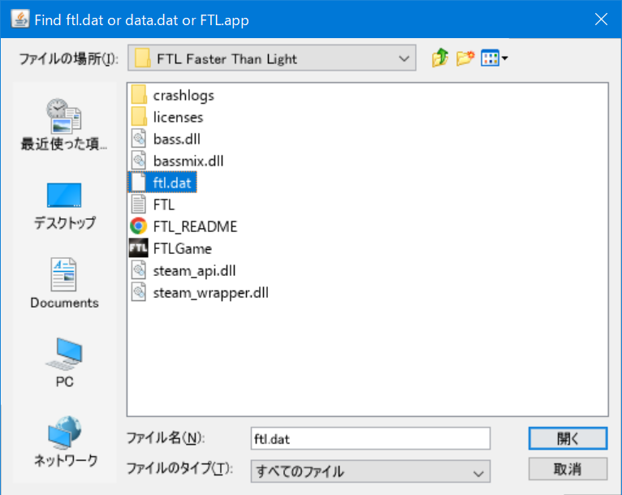

* 「Steam からインストールした？」私の場合は YES。
   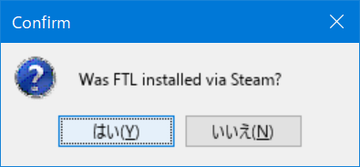

* 「Steam はここであってる？」 YES。
   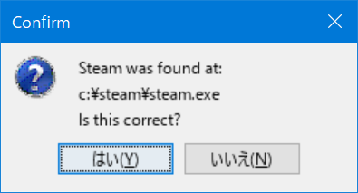

* 「FTLを直接起動する？ それともSteamから？」私の場合は Steam。
   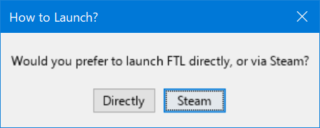

* 「Slipstream のアップデートの定期確認はする？」しない。
   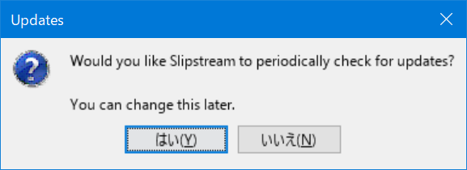

#### 5. Slipstream Mod Manager: パッチの選択と適用
Slipstream Mod Manager が起動できると、あらかじめ mods フォルダにいれておいた .ftl ファイルを読み込み一覧表示されます。
ここで、適用したいModをチェックをして「Patch」ボタンをクリックすると適用されますが、**順番が大事**です。チェックしたModを上から適用しますが、順序が正しくないと上手くいきません。
入れ替えたい項目をドラッグすることで移動できますので、以下にしたがって並べ替えとチェックをしてください。

順番は：
1. [ARS - Base Resources v1.27.1]
2. [ARS - Base Data]
3. [ARS - Base Data(日本語機械翻訳パッチ)]
4. [ARS - Infinite]
5. [ARS - Infinite(日本語機械翻訳パッチ)]
6. [ARS - A- Difficulty] または [ARS - A+ Difficulty]
7. [ARS - Non-Arsenal+ Ship Mod Fix]
8. [ARS - Ship Pack 1] または 2 または 3
9. [ARS - Ship Pack 1(日本語機械翻訳パッチ)] または 2 または 3（Ship Packの番号とあわせる）

※ Base Resources と Base Data だけが必須、4番以降はあっても無くてもいいらしいですが試してません

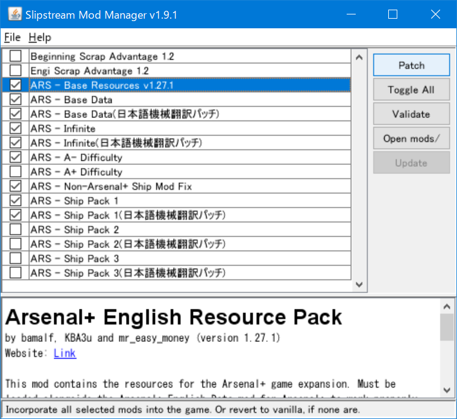

必要な項目にチェックをしたら Patch ボタンをクリックします。クリックするとパッチの適用が始まります。うまくいくと、今すぐ起動するか？と問い合わせが表示されます。ここまでくればOKです。

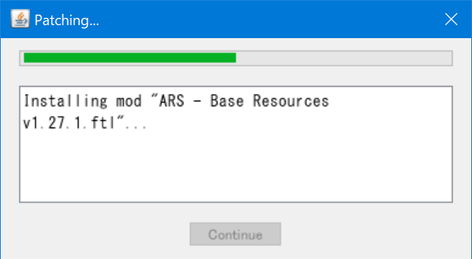
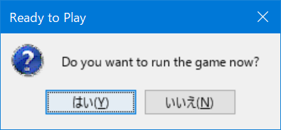

#### 6. FTL Arsenal+ 起動！
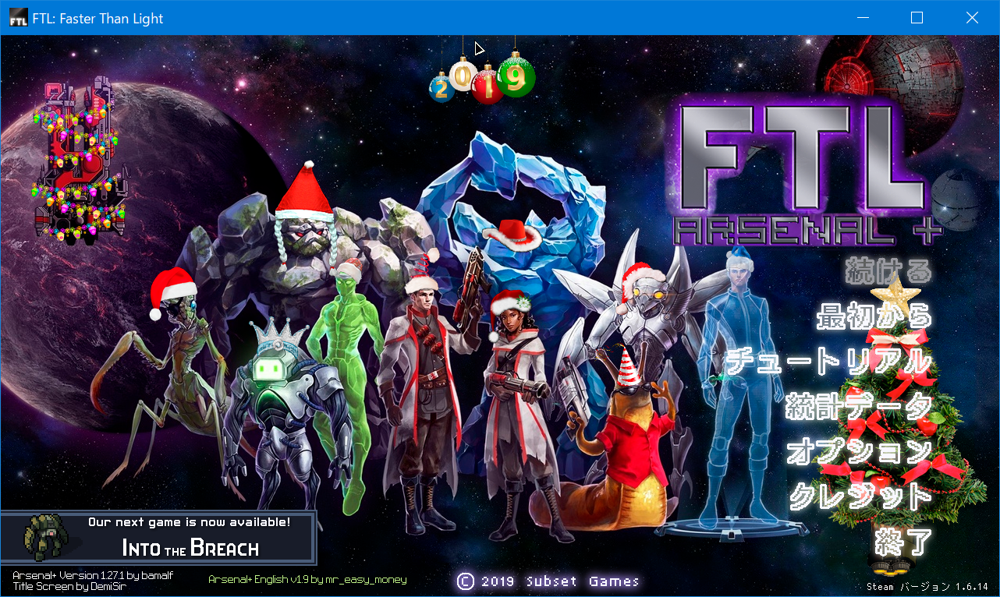
